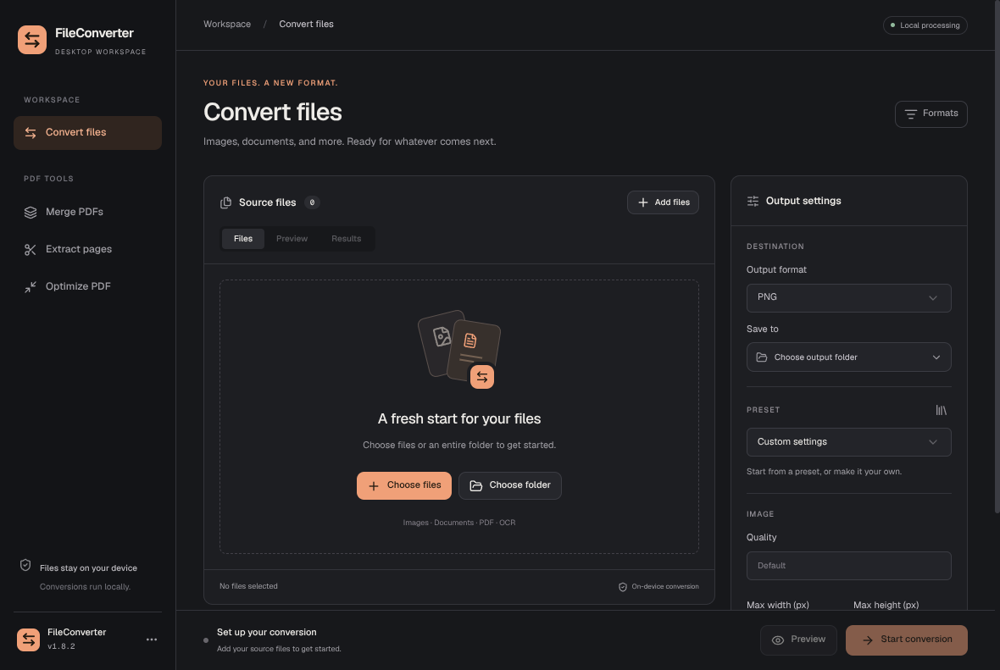

# FileConverter Desktop

Electron and React desktop app for the FileConverter conversion engine. The packaged app includes a Node.js worker that calls `@fileconverter/core`; users do not need to install Node.js separately.

## Features

- Convert selected files or an input folder, optionally including subfolders. Symlinks and the selected output subtree are skipped during folder scans.
- Preview input/output paths, unsupported conversions, and naming collisions without creating conversion output.
- Set image quality, maximum dimensions, and metadata handling. Empty fields preserve preset values or engine defaults.
- Select OCR languages when converting images to TXT, including combined codes such as `eng+nor`. The first OCR run may download recognition resources.
- Merge PDFs in a chosen order, extract page ranges, or optimize PDF structure. Optimization does not recompress embedded images or guarantee a smaller file.
- Apply built-in presets, or create and delete custom global/project presets. Local presets require an explicitly selected project folder; global presets are shared with the CLI.
- Configure parallel jobs and retry attempts, including zero retries.
- Export result JSON, attempt logs as JSON, and readable text logs, including failed jobs.
- Inspect supported format pairs and copy application/runtime version information.

Existing output files are never overwritten. Files with conflicting destination names are rejected before conversion. Select a different output folder or rename inputs to resolve collisions.

The output format selector shows how many selected files support each format. Mixed selections can produce partial success; the results list explains each failed file.

## Verification

From the repository root:

```bash
npm run build
npm run lint
npm test
```

Core regression tests cover OCR language forwarding, recursive scans, read-only dry runs, and preset precedence. GUI worker tests cover image metadata/dimensions, PDF operations, queue concurrency/retries, mixed inputs, and protection against overwrite races. Native Electron smoke checks additionally exercise file dialogs, conversion, report exports, local preset management, and PDF reordering through the renderer and IPC.

## Development

From the repository root:

```bash
npm install
npm run gui:dev
```

`gui:dev` builds the core package, starts Vite, and opens Electron.
Use Node.js 22 LTS to build desktop packages; Electron Forge's ZIP extraction failed under Node.js 26 during verification.

## Package

```bash
npm run gui:build
```

This builds core and the renderer, then creates a platform-specific app under `packages/gui/out/`. Run `npm run make --workspace @fileconverter/gui` to create consumer downloads under `out/installers/`:

| Platform | Download | User flow |
| --- | --- | --- |
| Windows x64 | `FileConverter-Setup-X.Y.Z-win-x64.exe` | Run setup; the app opens and appears in the Start menu. No administrator rights required. Uninstall through Windows Settings. |
| macOS Apple Silicon | `FileConverter-X.Y.Z-macos-arm64.dmg` | Open the disk image and drag FileConverter to Applications. |
| Ubuntu/Debian x64 | `FileConverter-X.Y.Z-linux-x64.deb` | Open in the system package installer. The app appears in the applications menu. |
| Other Linux x64 | `FileConverter-X.Y.Z-linux-x64.AppImage` | Allow execution in file properties, then open the single AppImage. No ZIP extraction. |

Build separately on Windows, macOS, and Linux. Electron Forge prepares the existing locked application bundle, and electron-builder 26.15.3 creates NSIS, DMG, DEB and AppImage distributions from that exact bundle (`--prepackaged`). This replaces the ZIP maker without rebuilding the native conversion dependencies for Electron. electron-builder is a pinned build-only dependency; it provides one maintained installer tool across platforms.

The desktop version belongs to `packages/gui/package.json` and releases use `gui-vX.Y.Z` tags. CI installs Windows/DEB packages, mounts the DMG, extracts the AppImage, and tests the installed bundled Node worker and an image conversion. Windows shortcuts and Linux desktop integration are also checked. Publication promotes these tested files with commit/version/hash verification.

The Windows and macOS builds currently have no publisher signing credentials. Windows may display an unknown-publisher warning, and macOS distribution is not Developer ID signed/notarized. Installers simplify packaging; trusted publisher identities additionally require a Windows signing certificate and an Apple Developer ID/notarization setup. Do not describe unsigned builds as signed or instruct users to disable system security protections.

The app uses Electron's native file and directory dialogs. The renderer has no Node.js access. Conversion runs in a separate bundled Node.js process through a small preload API. This keeps image processing isolated from the UI and avoids a known Sharp/Electron conflict on Linux.

## Desktop design



The desktop workspace uses a graphite palette, warm peach accent, bundled Geist fonts, and a matching app icon. Conversion and PDF tools live in the workspace sidebar. Presets open in a searchable library, formats in a searchable reference dialog, and app/version diagnostics in an About dialog from the app menu.

The renderer uses [shadcn/ui](https://ui.shadcn.com/) with Radix primitives and a lightly styled [React Bits SpotlightCard](https://reactbits.dev/components/spotlight-card). Components are owned in `src/components`, with Tailwind v4 and shared design tokens in `src/App.css`. Motion respects the operating system's reduced-motion preference. Fonts and UI assets are bundled; the interface needs no remote font service.

Run component commands from this package (or pass `--cwd packages/gui` from the root):

```bash
npx shadcn@latest add dialog --cwd packages/gui
npm run icons --workspace @fileconverter/gui
```

`components.json` at the repository root exposes the registries to the shadcn MCP; `packages/gui/components.json` configures the renderer's aliases and component destinations. The icon source is `icons/brand.svg`; the icon script generates PNG, Windows ICO, and macOS ICNS assets from it.
